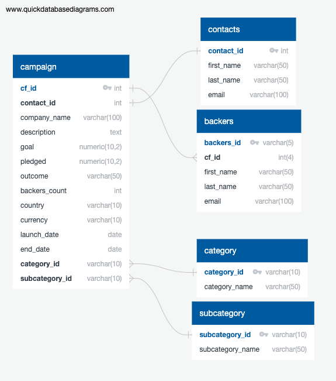
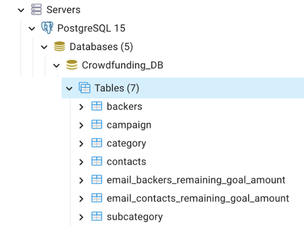

# Crowdfunding-ETL_Analysis

## Overview

### Resources

- Software:
    - pgAdmin 4(version 6.15(4280.88))
    - Jupyter Notebook
- Languges:
    - SQL
    - Python (pandas, json, regular expressions)
- Starting Data:
    - Backer Info Data (csv) [deliverables/deliverable_resources/backer_info.csv](deliverables/deliverable_resources/backer_info.csv)
    - Crowdfunding Data (xlsx) [module_practice/module_resources/crowdfunding.xlsx](module_practice/module_resources/crowdfunding.xlsx)
    - Contacts String Data (csv) [module_practice/module_resources/contacts_string_data.csv](module_practice/module_resources/contacts_string_data.csv)

## Results

### Generated Code 
- Extract Transform Final Code (Python)
[deliverables/deliverable_code/extract_transform_final_code.ipynb](deliverables/deliverable_code/extract_transform_final_code.ipynb)
- Crowdfunding Database Schema Code (SQL)
[deliverables/deliverable_code/crowdfunding_db_schema.sql](deliverables/deliverable_code/crowdfunding_db_schema.sql)
- Crowdfunding Analysis Code (SQL)
[deliverables/deliverable_code/crowdfunding_SQL_Analysis_code.sql](deliverables/deliverable_code/crowdfunding_SQL_Analysis_code.sql)

### Generated Data
- Backers Data (csv) [deliverables/deliverable_generated_data/backers.csv](deliverables/deliverable_generated_data/backers.csv) 
- E-mail Backers Remaining Goal Amount (csv) [deliverables/deliverable_generated_data/email_backers_remaining_goal_amount.csv](deliverables/deliverable_generated_data/email_backers_remaining_goal_amount.csv)
- Email Contacts Remaining Goal Amount (csv) [deliverables/deliverable_generated_data/email_contacts_remaining_goal_amount.csv](deliverables/deliverable_generated_data/email_contacts_remaining_goal_amount.csv)
- Campaign (csv) [module_practice/module_generated_data/campaign.csv](module_practice/module_generated_data/campaign.csv)
- Contacts (csv) [module_practice/module_generated_data/contacts.csv](module_practice/module_generated_data/contacts.csv)
- Category (csv) [module_practice/module_generated_data/category.csv](module_practice/module_generated_data/category.csv)
- Subcategory (csv) [module_practice/module_generated_data/subcategory.csv](module_practice/module_generated_data/subcategory.csv)

## Visualizations 

### Crowdfunding Database Relationship Diagram
[deliverables/deliverable_images/crowdfunding_db_relationships.png](deliverables/deliverable_images/crowdfunding_db_relationships.png)

### Crowdfunding Database  
[deliverables/deliverable_images/database_tables.png](deliverables/deliverable_images/database_tables.png)

